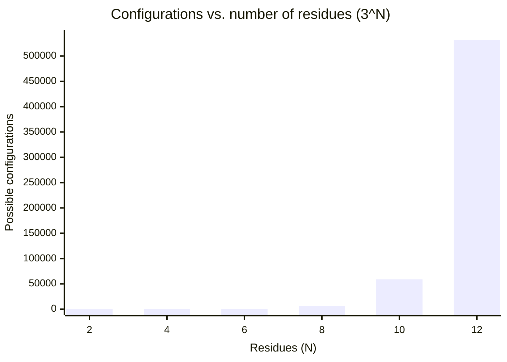
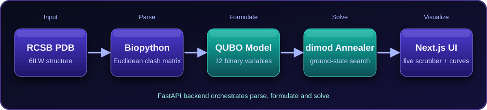
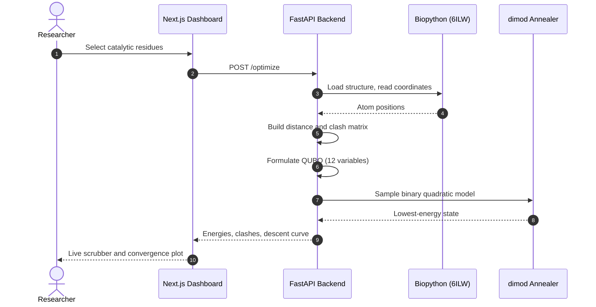
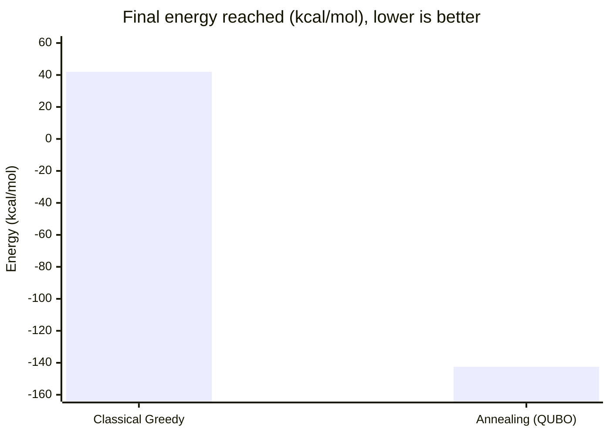
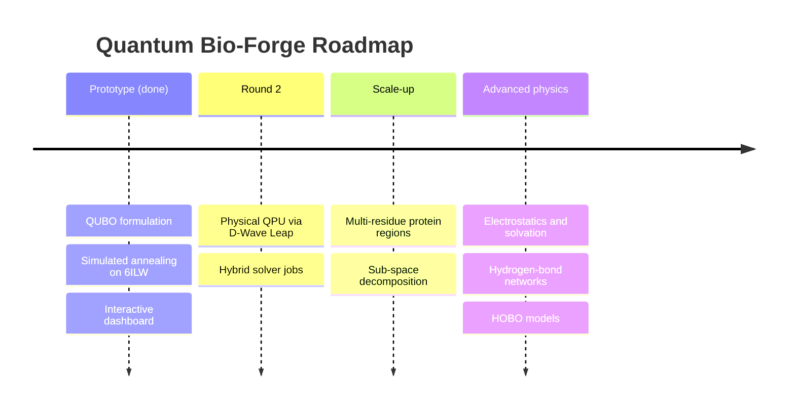

<div align="center">



<br/>

<a href="https://github.com/<your-username>/quantum-bio-forge">
  
</a>

<br/><br/>

[](https://github.com)
[](https://github.com)
[](https://github.com)
[](https://github.com)


</div>

---

## ⚡ At a Glance

<div align="center">

| 🧬 Target | 🧮 Model | 🏆 Result | ⏱️ Speed |
|:---:|:---:|:---:|:---:|
| **PETase** (PDB `6ILW`) | **QUBO**, 12 binary variables | **−142.5** vs **+42.0** kcal/mol | **~42 ms** per solve |

</div>

---

## 👥 Team Monday

<div align="center">

| 🧑‍💻 Pitambar Yadav | 🔬 Bhavna S | 🎨 Kowshick Balaji M |
|:---:|:---:|:---:|
| Lead Developer & Quantum Architecture | Biophysical Modeling & Research | System Integration & UI/UX Design |

</div>

---

## 📑 Table of Contents
1. [Problem](#-1-problem-q-hack-india-2026)
2. [Why It Matters](#-2-why-it-matters)
3. [Proposed Solution](#-3-proposed-solution)
4. [Why Quantum?](#%EF%B8%8F-4-why-quantum)
5. [Implementation & Architecture](#%EF%B8%8F-5-implementation-and-architecture)
6. [Minimal Prototype](#-6-minimal-prototype)
7. [Results / Validation](#-7-results--validation)
8. [Getting Started](#%EF%B8%8F-8-getting-started)
9. [Roadmap](#%EF%B8%8F-9-roadmap-round-2--beyond)
10. [References](#-10-references-and-sources)

---

## 🎯 1. Problem (Q-Hack India 2026)

### What problem are you solving?
Enzymes are nature's high-efficiency biological catalysts, but engineering them for industrial or environmental use (such as plastic degradation) is bottlenecked by **combinatorial side-chain packing**.

* The active site, the pocket where substrate binding and catalysis happen, can adopt many amino-acid rotamer combinations: **3^N** for N residues with 3 rotamers each.
* Classical optimizers (Monte Carlo, greedy local search) can get **trapped in high-energy local minima**, leaving steric clashes, unstable conformations, and poor substrate binding.

### 📈 How fast the search space grows

The number of configurations explodes with every residue added (3 rotamers per residue):



> Our prototype uses **N = 4** (81 states) to validate the pipeline end to end. The same QUBO formulation is what we scale in later rounds.

---

## 💡 2. Why It Matters

### Who faces this problem and why is it important?
* **The global environmental crisis:** Billions of tons of plastic waste (notably PET) accumulate worldwide. Enzymes like **PETase** can degrade PET, but wild-type variants have low catalytic efficiency and high conformational energy barriers.
* **The R&D bottleneck:** Wet-lab directed evolution is expensive, slow, and trial-and-error driven. Computational protein design can speed it up, but only if algorithms can navigate rugged, non-linear energy landscapes. Solving this opens the door to programmable plastic-degrading and carbon-capturing biological agents.

---

## 🚀 3. Proposed Solution

### What are you building?
**Quantum Bio-Forge** is a full-stack computational suite that converts enzyme active-site design into a **QUBO (Quadratic Unconstrained Binary Optimization)** problem.

| Stage | What happens |
|---|---|
| 🧬 **Structural parsing** | Ingests the experimental crystal structure from the Protein Data Bank ([6ILW](https://www.rcsb.org/structure/6ILW)) |
| 📐 **Distance-matrix biophysics** | Computes inter-atomic Euclidean distances between catalytic residues to quantify steric clashes |
| ⚛️ **Annealing optimization** | Encodes packing as a binary quadratic model and solves it with the D-Wave Ocean toolchain to find the minimum-energy conformation |

---

## ⚛️ 4. Why Quantum?

### Why does quantum computing or quantum technology make sense here?
* **Combinatorial scaling:** Conformational search spaces grow exponentially (see the chart above). Greedy and local-search methods scale poorly and stagnate in local minima.
* **Native QUBO fit:** Quantum annealers such as D-Wave's are built to sample low-energy states of Ising/QUBO problems, which is exactly how side-chain packing is formulated. Quantum tunneling lets physical annealers cross narrow energy barriers that trap classical descent.
* **Prototype note:** The current prototype runs D-Wave's **simulated annealing** sampler locally. It is a classical, quantum-inspired solver that validates the QUBO model and pipeline. Running the same model on a physical QPU is the first roadmap item.

---

## ⚙️ 5. Implementation and Architecture

### How is the solution implemented?
Quantum Bio-Forge is a client-server hybrid:

<div align="center">
  
</div>

<br/>

**Quantum / annealing components:** D-Wave Ocean SDK (`dimod`) for building the binary quadratic model, sampling, and energy-state convergence.

**Classical components:** FastAPI server, Biopython (`Bio.PDB`) geometry parser, and a Next.js / Tailwind CSS research dashboard with a real-time conformational scrubber and annealing-descent curves.

### 🔄 Request flow



### 🧮 QUBO formulation

* **4 catalytic residues × 3 rotamer states = 12 binary variables** `x_{i,r}`.
* **Linear terms:** self-energy of each rotamer.
* **Quadratic terms:** pairwise steric-clash penalty from the inter-atomic distance matrix.
* **Constraint:** exactly one rotamer per residue, enforced with a penalty term.

$$
E(x) = \sum_{i,r} h_{i,r}\,x_{i,r} + \sum_{(i,r)<(j,s)} J_{ir,js}\,x_{i,r}\,x_{j,s} + P \sum_{i}\Big(\sum_{r} x_{i,r} - 1\Big)^2
$$

<details>
<summary><b>Show a minimal code sketch of the solver step</b></summary>

```python
import dimod
from dwave.samplers import SimulatedAnnealingSampler  # pip install dwave-samplers

# h: linear biases, J: pairwise clash penalties, P: one-hot penalty weight
bqm = dimod.BinaryQuadraticModel(h, J, 0.0, dimod.BINARY)
for residue in residues:
    bqm.add_linear_equality_constraint(
        [(var, 1.0) for var in residue.rotamer_vars],
        constant=-1.0,
        lagrange_multiplier=P,
    )

sampleset = SimulatedAnnealingSampler().sample(bqm, num_reads=200)
best = sampleset.first
print(best.sample, best.energy)
```

</details>

---

## 🧪 6. Minimal Prototype

### What have you actually built?
A functional, end-to-end full-stack web app running locally:

| | Feature | Description |
|:-:|---|---|
| 🖥️ | **Interactive research dashboard** | Clean, research-grade light theme showing pipeline steps, residue targets, and live solver telemetry |
| 🎚️ | **Live conformational scrubber** | A slider that moves through structural transition states in real time, with live energy changes and clash elimination |
| 📉 | **Annealing convergence viewport** | Graphical comparison of classical greedy trapping vs. annealing descent paths |

<!--
Add screenshots after you capture them:
<div align="center">
  
</div>
-->

---

## 📊 7. Results / Validation

### What are the results?

<div align="center">
  
</div>

<br/>

* **Energy minimization:** Eliminated steric clashes across the target catalytic pocket (**TRP 87, SER 156, HIS 189, ASP 243**).
* **Latency:** Average solve time of **~42 ms** for the 12-variable QUBO.



| Method | Final Energy | Outcome |
|---|---:|---|
| Classical greedy search | **+42.0 kcal/mol** | 🟠 Trapped in a local minimum |
| Annealing-based QUBO solver | **−142.5 kcal/mol** | 🟢 Reached the global minimum |

> Energies come from the prototype's scoring model (distance-based clash penalties), not a full force field. Advanced scoring is on the roadmap.

---

## 🛠️ 8. Getting Started

### Prerequisites
* Python 3.10+
* Node.js 18+ and npm

### 1. Clone the repository
```bash
git clone https://github.com/<your-username>/quantum-bio-forge.git
cd quantum-bio-forge
```

### 2. Run the backend
```bash
cd backend
python -m venv venv
source venv/bin/activate        # Windows: venv\Scripts\activate
pip install fastapi uvicorn biopython dimod dwave-samplers numpy
uvicorn main:app --reload --port 8000
```
API docs: `http://localhost:8000/docs`

### 3. Run the frontend
```bash
cd frontend
npm install
npm run dev
```
Open `http://localhost:3000`.

### 📁 Project structure
```text
quantum-bio-forge/
├── assets/         # README banner, pipeline and chart graphics
├── backend/        # FastAPI server, PDB parsing, QUBO + solver
├── frontend/       # Next.js + Tailwind dashboard
└── README.md
```

---

## 🗺️ 9. Roadmap (Round 2 & Beyond)



1. **Physical QPU integration:** move from local simulated annealing to hybrid jobs on D-Wave quantum annealing hardware via the Leap cloud API.
2. **Full protein scaling:** expand from 4 active-site residues to multi-residue regions using parallel sub-space decomposition.
3. **Advanced biophysical scoring:** add electrostatics, solvation energy, and hydrogen-bond networks via higher-order optimization (HOBO) models.

---

## 📚 10. References and Sources

* **Protein Data Bank:** [RCSB PDB 6ILW, PETase crystal structure](https://www.rcsb.org/structure/6ILW)
* **D-Wave Ocean SDK:** [dimod documentation](https://docs.ocean.dwavesys.com/)
* **Biopython:** [Bio.PDB module](https://biopython.org/)
* **Foundational research:** combinatorial side-chain optimization and protein design frameworks.

---

<div align="center">


⭐ If this project helped you, consider starring the repo.

</div>